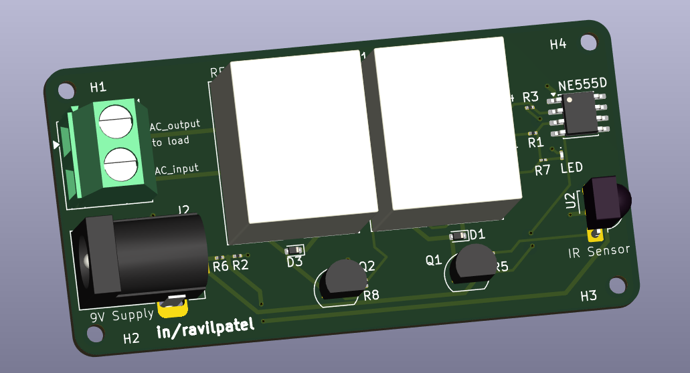
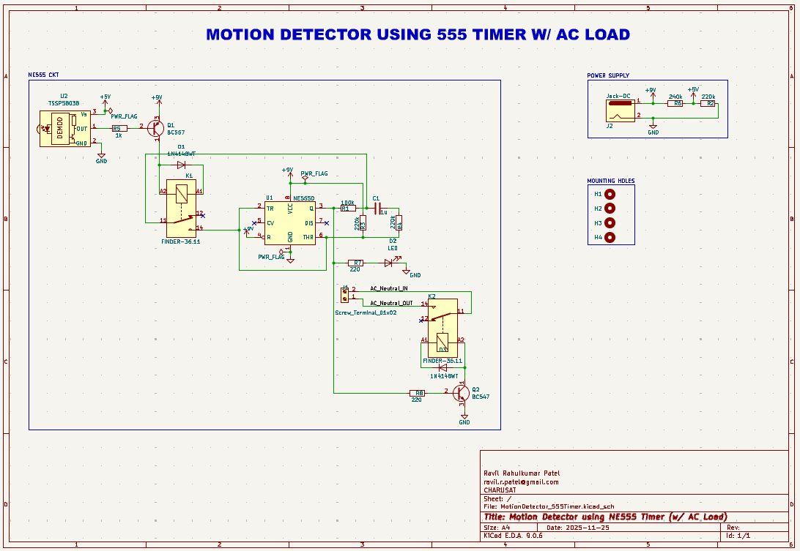
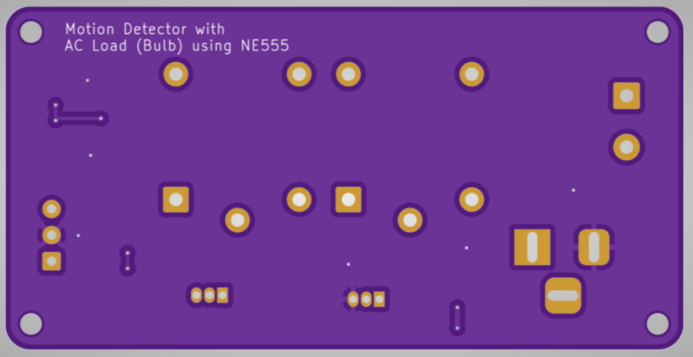
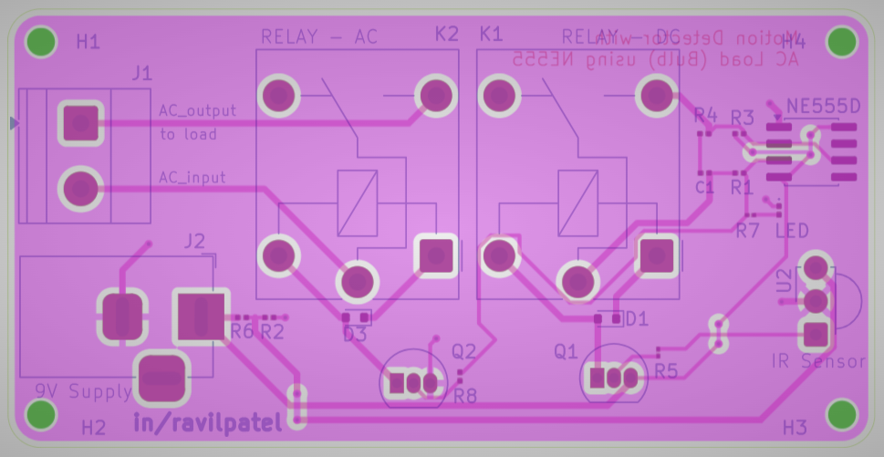

# STM32 PCB — KiCAD 9.0

**2-layer Motion Detector using NE555**

This repository contains the KiCAD 9.0 project files, documentation and assets for a compact 2-layer PCB built with NE555 Timer IC. The board is designed for manufacturability on standard FR4 (1.6 mm) and targets hobbyist / low-volume production.

<div align="center">

</div>

---

## Design specifications

* **Design software:** KiCAD 9.0
* **Integrated Circuit (IC):** NE555 Timer IC (schematic & part references in BOM)
* **Layers:** 2 (Top / Bottom)
* **Board dimensions:** **65.0 mm × 32.4 mm**
* **Substrate:** FR4, **1.6 mm** thickness
* **Files included:** KiCAD project files, schematic, PCB layout, Gerber export instructions, BOM
* **Protocols supported:** UART, I2C, SWD

---

## Repository layout

```
/ (repo root)
├─ README.md
├─ MotionDetector_555Timer.kicad_pcb
├─ MotionDetector_555Timer.kicad_sch
├─ MotionDetector_555Timer.kicad_pro
├─ MotionDetector_555Timer.kicad_prl              
├─ /Manufacturing/            # Generated Gerber + drill files (ready for fab) in zip, BOM in CSV
├─ /images/                   # Schematic + top/bottom/layers view images
│   ├─ schematic.png
|    ├─ PCB.png
│   ├─ top.png
│   ├─ bottom.png
│   └─ layers.png
```

---

## Schematic Sheet


---

## PCB View

**Top View**


**Bottom View**



**Layers View**



---

## BOM

Autogenerated BOM from KiCAD
| Reference   | Qty | Value                | DNP | Exclude from BOM  | Footprint                                                                      | Datasheet                                                        |
| ----------- | --- | -------------------- | --- | ----------------- | ------------------------------------------------------------------------------ | ---------------------------------------------------------------- |
| C1          | 1   | 1u                   |     |                   | Capacitor_SMD:C_0201_0603Metric                                                | ~                                                                |
| D1,D3       | 2   | 1N4148WT             |     |                   | Diode_SMD:D_SOD-523                                                            | https://www.diodes.com/assets/Datasheets/ds30396.pdf             |
| D2          | 1   | LED                  |     |                   | LED_SMD:LED_0201_0603Metric                                                    | ~                                                                |
| H1,H2,H3,H4 | 4   | MountingHole         |     | Excluded from BOM | MountingHole:MountingHole_2.1mm                                                | ~                                                                |
| J1          | 1   | Screw_Terminal_01x02 |     |                   | TerminalBlock_Phoenix:TerminalBlock_Phoenix_MKDS-1,5-2_1x02_P5.00mm_Horizontal | ~                                                                |
| J2          | 1   | Jack-DC              |     |                   | Connector_BarrelJack:BarrelJack_Horizontal                                     | ~                                                                |
| K1,K2       | 2   | FINDER-36.11         |     |                   | Relay_THT:Relay_SPDT_Finder_36.11                                              | https://gfinder.findernet.com/public/attachments/36/EN/S36EN.pdf |
| Q1          | 1   | BC557                |     |                   | Package_TO_SOT_THT:TO-92_Inline                                                | https://www.onsemi.com/pub/Collateral/BC556BTA-D.pdf             |
| Q2          | 1   | BC547                |     |                   | Package_TO_SOT_THT:TO-92_Inline                                                | https://www.onsemi.com/pub/Collateral/BC550-D.pdf                |
| R1          | 1   | 100k                 |     |                   | Resistor_SMD:R_0201_0603Metric                                                 | ~                                                                |
| R2,R3,R4    | 3   | 220k                 |     |                   | Resistor_SMD:R_0201_0603Metric                                                 | ~                                                                |
| R5          | 1   | 1k                   |     |                   | Resistor_SMD:R_01005_0402Metric                                                | ~                                                                |
| R6          | 1   | 240k                 |     |                   | Resistor_SMD:R_0201_0603Metric                                                 | ~                                                                |
| R7,R8       | 2   | 220                  |     |                   | Resistor_SMD:R_01005_0402Metric                                                | ~                                                                |
| U1          | 1   | NE555D               |     |                   | Package_SO:SOIC-8_3.9x4.9mm_P1.27mm                                            | http://www.ti.com/lit/ds/symlink/ne555.pdf                       |
| U2          | 1   | TSSP58038            |     |                   | OptoDevice:Vishay_MINICAST-3Pin                                                | http://www.vishay.com/docs/82476/tssp58p38.pdf                   |


---


